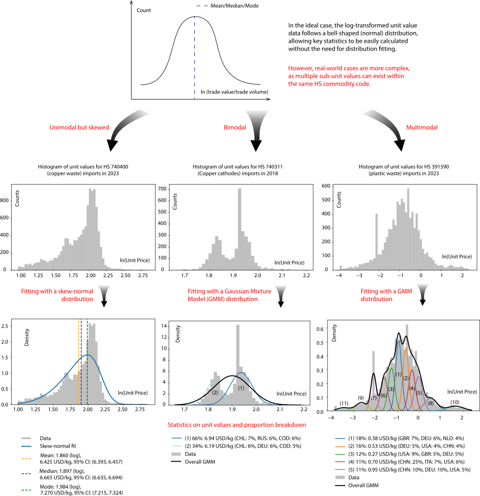

# UVPicker

## Introduction
**UVPicker** is a Python package designed to analyze the **unit value distribution** of **HS-coded commodities** in the international trade.  
The core function, **`main.py`**, is supported by three submodules:
- **`uv_preparation`** – Data extraction and preprocessing  
- **`uv_analysis`** – Statistical analysis and modeling  
- **`uv_visualization`** – Graphical representation of unit value distributions  

### **Why UVPicker?**
When analyzing the unit values of a traded product across countries, several key questions arise:
- Should we simply collect all unit values and calculate the **mean**?  
- How can we determine whether unit values are **normally distributed** before relying on the mean?  
- What if the dataset includes multiple **sub-products**, each with a distinct unit value mean?  

**UVPicker** is designed to answer these questions by employing statistical techniques to identify **unimodal vs. multimodal distributions** and provide **robust trade value insights** (see illustration below).  

---

## **Main Steps**
UVPicker follows a structured workflow to ensure accurate unit value analysis:

1. **Data Extraction**  
   - Retrieves **bilateral trade data** using the [UN Comtrade API](https://github.com/uncomtrade/comtradeapicall)  
   - Requires inputs: **HS code, year, and trade direction** (imports or exports)
     
2. **Data cleaning**  
   - Dropping the sum-up trade in the original 'plus' breakdown mode (eg. trade of country A to the world)
     
3. **Outlier Detection**  
   - Applies the **[modified z-score method](https://books.google.com/books?hl=en&lr=&id=FuuiEAAAQBAJ&oi=fnd&pg=PP1&dq=modified+z+score+MAD&ots=SFP_S9VOSl&sig=KJf70cPJ5eE7Ojn9I5smb7BpqgI)** to filter extreme values  

4. **Unimodality Test**  
   - Uses **[Hartigan's Dip Test](https://projecteuclid.org/journals/annals-of-statistics/volume-13/issue-1/The-Dip-Test-of-Unimodality/10.1214/aos/1176346577.full)** to check if the unit value distribution is unimodal  

5. **Distribution Fitting**  
   - Fits a **unimodal distribution** (Normal, Skew-Normal, etc.) or a **multimodal distribution** (Gaussian Mixture Model, GMM)  

6. **Statistical Reporting & Visualization**  
   - Computes key statistics:  
     - **Mean, median, mode**  
     - **Proportions of each peak**  
     - **95% confidence intervals**  
   - Generates **plots** to illustrate unit value distributions  

---
## **Returned Results Explanation (Examples)**

- **"In 2023, the unit values for HS 740400 imports are represented by a single cluster**, with a **mean unit price** of **1.86 USD/kg** (95% Confidence Interval (CI): **1.855–1.865**), a **median value** of **1.897 USD/kg** (95% CI: **1.893–1.901**), and  a **mode value** of **1.984 USD/kg** (95% CI: **1.977–1.992**)."  

- **"In 2018, the unit values for HS 740311 imports are represented by two clusters** with their **mean unit prices** at:  
  - **6.940 USD/kg** (95% CI: **6.928–6.953**), accounting for **66.42%** of the total trade  
    (main sources: **CHL: 6.98%**, **RUS: 6.20%**, **COD: 5.81%**).  
  - **6.186 USD/kg** (95% CI: **6.174–6.197**), accounting for **33.58%**  
    (main sources: **CHL: 6.37%**, **DEU: 5.66%**, **COD: 5.04%**).  
  *(Countries are represented by their ISO Alpha-3 codes.)*  

- **"In 2023, the unit values for HS 391590 imports are represented by 11 clusters**, with their **mean unit prices** and **95% confidence intervals** as follows:  

  | **Cluster** | **Mean Unit Price (USD/kg)** | **95% CI** |
  |------------|----------------------|-------------|
  | 1 | 0.381 | (0.378, 0.383) |
  | 2 | 0.527 | (0.523, 0.531) |
  | 3 | 0.274 | (0.272, 0.277) |
  | 4 | 0.699 | (0.693, 0.706) |
  | 5 | 0.946 | (0.936, 0.957) |
  | 6 | 0.197 | (0.194, 0.199) |
  | 7 | 0.121 | (0.120, 0.122) |
  | 8 | 1.634 | (1.598, 1.671) |
  | 9 | 0.070 | (0.069, 0.072) |
  | 10 | 4.983 | (4.774, 5.201) |
  | 11 | 0.031 | (0.030, 0.032) |

  **Cluster composition by country:**  
  - **Cluster 1 (17.61%)** – GBR: **6.58%**, DEU: **6.39%**, NLD: **4.22%**  
  - **Cluster 2 (15.62%)** – DEU: **4.96%**, USA: **4.44%**, CHN: **4.24%**  
  - **Cluster 3 (11.53%)** – USA: **8.66%**, GBR: **5.46%**, DEU: **4.79%**  
  - **Cluster 4 (11.39%)** – CHN: **24.83%**, ITA: **6.90%**, USA: **5.86%**  
  - **Cluster 5 (11.06%)** – CHN: **10.31%**, DEU: **10.14%**, USA: **4.90%**  
  - **Cluster 6 (9.50%)** – ITA: **10.09%**, DEU: **7.78%**, GBR: **7.49%**  
  - **Cluster 7 (8.02%)** – CHN: **5.44%**, USA: **5.04%**, DEU: **4.84%**  
  - **Cluster 8 (6.44%)** – DEU: **5.40%**, THA: **4.93%**, NLD: **4.55%**  
  - **Cluster 9 (3.88%)** – GBR: **7.75%**, AUT: **5.16%**, DEU: **4.34%**  
  - **Cluster 10 (3.29%)** – DEU: **7.79%**, BEL: **5.68%**, USA: **5.15%**  
  - **Cluster 11 (1.65%)** – DEU: **12.93%**, ITA: **8.16%**, GIB: **8.16%**  

  *(Countries are represented by their ISO Alpha-3 codes.)*
---
